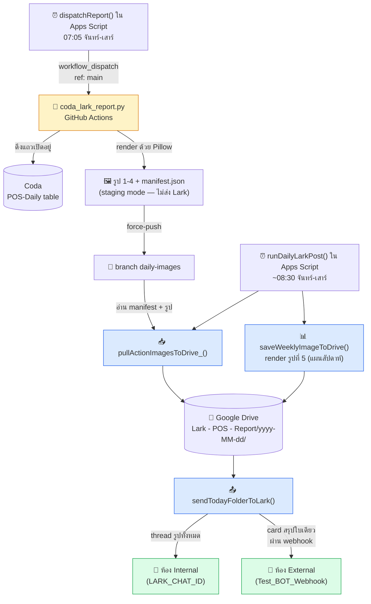

# POS Daily Lark Report

ดึงแถวที่ยังเปิดอยู่จากตาราง Coda "POS-Daily" มาสร้างรูปรายงาน แล้วส่งเข้า Lark
เป็น thread รูปภาพ (ห้อง internal) พร้อม card สรุปใบเดียว (ห้อง external)
pipeline นี้แบ่งเป็น 2 runtime:

- **GitHub Actions (Python)** — ดึงข้อมูล Coda, render รูป 1-4, เตรียมไฟล์ไว้
  (**ไม่ได้ส่งเข้า Lark เอง** — ดูหัวข้อ "Staging mode" ด้านล่าง) แล้ว push
  ขึ้น branch `daily-images`
- **Google Apps Script** — ดึงรูปพวกนั้นเข้า Google Drive, render รูปแผนการ
  รับงานผลิตประจำสัปดาห์ (รูปที่ 5), โพสต์รูปทั้งหมดเป็น thread เดียวใน Lark,
  แล้วส่ง card สรุปใบเดียวเข้าห้อง external ผ่าน webhook
  **นี่คือส่วนเดียวใน pipeline ที่คุยกับ Lark API เพื่อส่งข้อความจริงๆ**

เดิมโปรเจกต์นี้เป็นการ rewrite สคริปต์ PowerShell/`System.Drawing` ที่เคยรันบน
เครื่อง Windows มาเป็น Python/Pillow (ใช้ Coda doc/table/filter/columns/sort
เดียวกัน, layout เหมือนเดิม) แล้วค่อยขยายมาเป็น Apps Script + Drive layer
ตามที่อธิบายด้านล่าง

## Architecture / pipeline



1. **`scripts/coda_lark_report.py`** (GitHub Actions, ทริกเกอร์แบบ
   `workflow_dispatch` เท่านั้น — **ปิด cron ไปแล้ว** — ถูกเรียกโดย
   `dispatchReport()` ของ Apps Script ตอน 07:05 จันทร์-เสาร์ ผ่าน GitHub
   Actions API ด้วย `ref: 'main'`) — ดึงแถว POS-Daily ที่ยังเปิดอยู่จาก Coda,
   render รูปตารางแบบจัดกลุ่ม (รูป 1-4), แล้ว push รูปพวกนั้นพร้อม
   `manifest.json` ไปที่ branch `daily-images` (ไม่ใช่ `main`)
2. **`scripts/lark-drive-thread.gs`** (Apps Script, ทริกเกอร์ ~08:30
   จันทร์-เสาร์ ผ่าน `runDailyLarkPost()`):
   - `pullActionImagesToDrive_()` อ่าน `manifest.json` จาก branch
     `daily-images` แล้วเซฟรูป 1-4 ลงโฟลเดอร์รายวันใน Drive
     (`Lark - POS - Report/yyyy-MM-dd/`)
   - `saveWeeklyImageToDrive()` render รูปแผนการรับงานผลิตประจำสัปดาห์
     (รูปที่ 5) ผ่าน `renderWeeklyReportImage_()` (helper ที่ใช้ร่วมกัน
     ดูด้านล่าง) แล้วเซฟลงโฟลเดอร์เดียวกัน
   - `sendTodayFolderToLark()` สร้าง Lark thread เดียว (ห้อง internal,
     `LARK_CHAT_ID`) รวมรูปทั้งหมดในโฟลเดอร์ แล้วส่ง card สรุปใบเดียวเข้า
     ห้อง external ผ่าน `Test_BOT_Webhook` (ห้อง external รับ thread ไม่ได้
     — webhook รองรับแค่ card เดียว)
3. **`scripts/lark-appsscript-complete.gs`** — helper Lark ที่ใช้ร่วมกัน
   ระหว่างไฟล์ `.gs` ทั้งสอง (`getLarkTenantToken_`, `uploadImageToLark_`,
   `createThreadRoot_`, `replyImageInThread_`, `sendCardToExternal_`,
   `renderWeeklyReportImage_`, `readWeeklySheetData_`,
   `formatBangkokTimestamp_`) พร้อม flow สำรองแบบส่งรูปสัปดาห์อย่างเดียว
   (`sendWeeklyProductionReport()` / `sendWeeklyReportToLark_()`) เก็บไว้
   เป็นทาง alternate/fallback ที่โพสต์รูปสัปดาห์เองแยกจาก flow ผ่านโฟลเดอร์
   Drive

ไฟล์ `.gs` ทั้งสองต้องอยู่ **โปรเจกต์ Apps Script เดียวกัน** —
`lark-drive-thread.gs` เรียก helper ที่ประกาศใน `lark-appsscript-complete.gs`
ได้ตรงๆ (Apps Script ไม่มี import, ทุกไฟล์ในโปรเจกต์เดียวกันแชร์ scope กัน)

### Staging mode — GitHub Actions ไม่ได้ส่งเข้า Lark เอง

`coda_lark_report.py` มี 2 โหมด สลับด้วย env var:

- **Staging mode (โหมดที่ใช้จริงตอนนี้)** — ตั้ง `POS_STAGE_DIR=images` และ
  **ไม่ได้** ตั้ง `POS_KEEP_DIRECT_LARK` สคริปต์จะ render รูปแล้วเขียน
  `manifest.json` ไว้ในเครื่องเท่านั้น (`stage_images_for_gas(...)`) ไม่เรียก
  Lark send-message API เลย จากนั้น step ถัดไปของ workflow จะ push ไฟล์
  พวกนั้นขึ้น branch `daily-images` ให้ Apps Script ไปดึงต่อ
- **Direct-send mode (ของเก่า/ไม่ได้ใช้แล้ว)** — ตั้ง `POS_KEEP_DIRECT_LARK=1`
  (และไม่ใส่/ไม่สนใจ `POS_STAGE_DIR`) เพื่อให้สคริปต์เรียก Lark API เองโดยใช้
  `LARK_APP_ID` / `LARK_APP_SECRET` / `LARK_CHAT_ID` จาก env ของ job

เพราะ workflow ตอนนี้ตั้ง `POS_STAGE_DIR: images` ไว้ และ**ไม่ได้**ตั้ง
`POS_KEEP_DIRECT_LARK` ตัวแปร `LARK_APP_ID` / `LARK_APP_SECRET` /
`LARK_CHAT_ID` / `LARK_EXTERNAL_WEBHOOK_URL` ใน step "Run POS Daily report"
(ตอนนี้ผูกกับ secrets ชุด `_TEST` — `APP_ID_TEST`, `APP_SECRET_TEST`,
`LARK_CHAT_ID_TEST`, `LARK_WEBHOOK_URL_TEST`) **ไม่ถูกใช้ส่งอะไรเลย** —
โค้ดส่วนนั้นถูก skip ไปทั้งหมด ถือว่าเป็นค่าที่ไม่มีผลอะไรในการตั้งค่าปัจจุบัน

**ปลายทางและ credential จริงถูกกำหนดโดย Script Properties ของ Apps Script
เท่านั้น** (ดู section 3 ด้านล่าง) — `LARK_CHAT_ID`, `Test_BOT_Webhook` ฯลฯ
ที่ตั้งไว้ตรงนั้น แยกกันคนละที่จาก env ของ GitHub Actions workflow เลย
ดังนั้น secrets `_TEST` ที่อยู่ใน workflow ไม่มีผลต่อปลายทางจริงที่รายงาน
ประจำวันถูกส่งไป

### หัว Card ฝั่ง External

Card ที่ส่งเข้าห้อง Lark ฝั่ง external เอาหัวข้อมาจาก `sendCardToExternal_()`
ใน `scripts/lark-appsscript-complete.gs`:

```javascript
header: { title: { tag: 'plain_text', content: '📦 รายงาน POS Daily / แผนการรับงานผลิตได้ประจำสัปดาห์ PD' }, template: 'blue' },
```

แก้บรรทัดนี้ตรงๆเพื่อเปลี่ยนหัว card — เป็นอิสระจาก `WEEKLY_REPORT_TITLE`
(ตัวที่ยังคุมข้อความ root ของ Lark thread และหัวข้อที่พิมพ์อยู่ในรูปรายงาน
สัปดาห์)

## 1. สร้าง repo

Push เนื้อหาในโฟลเดอร์นี้ไปที่ root ของ GitHub repository ใหม่ (เก็บ
`.github/workflows/pos-daily-report.yml` ไว้ที่ path นี้เป๊ะๆ — GitHub
Actions มองหาไฟล์ workflow ที่ path นี้เท่านั้น)

## 2. เพิ่ม repo secrets (ฝั่ง GitHub Actions)

ไปที่ **Settings → Secrets and variables → Actions → New repository secret**
แล้วเพิ่ม:

| ชื่อ Secret | ค่า | หาได้จากไหน |
|---|---|---|
| `CODA_API_TOKEN` | Coda API token | coda.io → Account Settings → API Settings → Generate API token |
| `LARK_APP_ID` | Lark custom app id | Lark Open Platform → custom app ของคุณ → Credentials |
| `LARK_APP_SECRET` | Lark custom app secret | หน้าเดียวกับข้างบน |
| `LARK_CHAT_ID` | Lark group chat ID เช่น `oc_xxxxxxxxxxxxxxxxx` | เปิดรายละเอียดกลุ่มปลายทางแล้ว copy chat ID — bot ต้องอยู่ในกลุ่มนั้นด้วย |

Doc ID (`MiXbfRif1m`) และ table ID (`table-OA56XddNFI`) ไม่ใช่ความลับ —
เป็นค่า default ที่ hardcode ไว้ใน `scripts/coda_lark_report.py` แต่
override ได้ด้วย secret หรือ repo variable `CODA_DOC_ID` / `CODA_TABLE_ID`
ถ้าจะย้ายไปใช้ doc/table อื่น

> **หมายเหตุ:** ใน workflow ปัจจุบัน secrets ชุด Lark พวกนี้ถูกส่งเข้าไปเป็น
> `_TEST` variant (`APP_ID_TEST`, `APP_SECRET_TEST`, `LARK_CHAT_ID_TEST`,
> `LARK_WEBHOOK_URL_TEST`) และตาม "Staging mode" ด้านบน — ไม่ได้ถูกใช้ส่ง
> อะไรจริงๆ เพราะ staging mode (`POS_STAGE_DIR`) เปิดอยู่ credential ที่ใช้
> ส่งจริงอยู่ที่ Script Properties ของ Apps Script เท่านั้น (section 3)

## 3. Apps Script Properties (ฝั่ง Apps Script, คนละที่กับ GitHub secrets)

ตั้งค่าพวกนี้ใน Apps Script project ที่ **Project Settings → Script
Properties** (ไม่ใช่ GitHub secrets — Apps Script อ่าน secrets ของ GitHub
ไม่ได้):

| Property | ค่า |
|---|---|
| `LARK_APP_ID`, `LARK_APP_SECRET` | custom app Lark ตัวเดียวกับข้างบน |
| `GH_TOKEN` | classic PAT ที่มีสิทธิ์ `repo`/`contents:read` — ใช้อ่าน `manifest.json` / รูปจาก branch `daily-images` |
| `LARK_CHAT_ID` | ห้อง internal สำหรับ thread รายวัน (ถ้าไม่ตั้งจะ fallback ไปใช้ห้อง `เทสโต้` ที่ hardcode ไว้ใน `lark-appsscript-complete.gs`) |
| `DRIVE_IMAGES_FOLDER_ID` | โฟลเดอร์แม่ใน Drive ("Lark - POS - Report") ถ้าไม่ตั้งจะ fallback ไปใช้ค่า default ที่ hardcode ไว้ |
| `Test_BOT_Webhook` | webhook URL สำหรับ card สรุปฝั่งห้อง external |
| `WEEKLY_LARK_WEBHOOK_URL` | webhook เดิม ใช้แค่กับ fallback `sendImageToLark_()` ตัวเก่า |

**นี่คือชุด credential ที่กำหนดปลายทางจริงว่ารายงานจะถูกส่งไปที่ไหน** — ดู
"Staging mode" ด้านบน

## 4. เปลี่ยนไปจากเวอร์ชัน PowerShell เดิมยังไงบ้าง

- **Runner**: ใช้ `ubuntu-latest` แทนเครื่อง Windows ของคุณ — ถูกกว่าและเร็ว
  กว่าบน GitHub Actions
- **Rendering**: ใช้ Pillow แทน `System.Drawing` ตัวอักษรไทยต้องใช้ font
  TrueType ที่มี glyph ไทย เลยให้ workflow ลง apt package `fonts-thai-tlwg`
  (ตระกูล Waree) ก่อนรันสคริปต์
- **การเข้าถึง Coda**: เรียก public Coda REST API ตรงๆด้วย API token
  (`requests`) แทนการผ่าน MCP connector พารามิเตอร์ `query` ของ API รองรับ
  แค่ exact-match filter ไม่รองรับ `IsBlank()` เลยต้องดึงทุกแถวมาก่อน
  (แบ่งหน้า, ดึงแค่คอลัมน์ที่ต้องใช้) แล้วกรองแถวที่ `รอคุยในที่ประชุม`
  ว่างเปล่าด้วย Python เอง — ผลลัพธ์เหมือนกัน แค่ทำที่ฝั่ง client แทนฝั่ง
  server
- **Secrets**: token ของ Coda, credential ของ Lark app, และ chat ID อ่านจาก
  environment variable ที่ผูกกับ GitHub Actions secrets ไม่ hardcode เลย
- **การส่งข้อมูล**: รูปไม่ได้ยิงตรงเข้า webhook แล้ว — GitHub Actions ตอนนี้
  แค่เตรียมรูป/manifest ไว้ให้ Apps Script (ดู "Staging mode" ด้านบน) ส่วน
  Apps Script (`lark-drive-thread.gs`) เป็นคนเพิ่มรูปแผนการรับงานผลิต
  ประจำสัปดาห์แล้วโพสต์ทุกอย่างเป็น Lark thread เดียว พร้อม card สรุปเข้า
  ห้อง external อีกใบ

## 5. ไฟล์ในโปรเจกต์

```
.github/workflows/pos-daily-report.yml        # workflow_dispatch เท่านั้น (ไม่มี cron); รัน coda_lark_report.py แบบ staging mode
.github/workflows/pos-daily-report-test.yml   # รันทดสอบด้วยมือ
.github/workflows/find-lark-chat-id.yml       # helper ใช้ครั้งเดียวสำหรับหา Lark chat_id
scripts/coda_lark_report.py                   # Coda -> Pillow รูป 1-4 -> branch daily-images (staging mode; ไม่ได้ส่งเข้า Lark)
scripts/drive_upload.py                       # helper อัปโหลด Drive (service account) ใช้เฉพาะโหมด fallback อัป Drive ตรงแบบเก่า
scripts/drive_check.py                        # เช็คก่อนใช้งานจริง: ยืนยันว่า service account เขียนโฟลเดอร์ Shared Drive ได้
scripts/lark-appsscript-complete.gs           # helper Lark ที่ใช้ร่วมกัน + flow รายงานสัปดาห์แบบ standalone
scripts/lark-drive-thread.gs                  # flow หลักรายวัน: โฟลเดอร์ Drive -> Lark thread -> card external (ขั้นตอนเดียวที่ส่งเข้า Lark จริง)
scripts/tests/                                # สคริปต์ทดสอบ
requirements.txt                              # requests, Pillow
latest_thread.json                            # เขียนโดย GitHub Actions; อ่านโดย flow หา thread แบบเก่าใน lark-appsscript-complete.gs
POS-LARK-HANDOFF.md                           # บันทึก handoff แบบละเอียด (ประวัติการตั้งค่า, การแก้บัค, เหตุผลการออกแบบ)
```

ดูประวัติการออกแบบและการแก้ปัญหาแบบละเอียดได้ที่
**[POS-LARK-HANDOFF.md](./POS-LARK-HANDOFF.md)**

## 6. ทดสอบก่อนจะพึ่ง schedule จริง

Push repo, เพิ่ม secrets แล้วรัน workflow ด้วยมือครั้งเดียวจากแท็บ
**Actions** ("Run workflow") แล้วเช็ค branch `daily-images` ว่ามีรูป/manifest
ใหม่ไหม จากนั้นรัน `runDailyLarkPost()` ด้วยมือจาก Apps Script editor แล้ว
เช็คทั้งห้อง Lark internal (thread ที่มีรูปครบ) และห้อง external (card
สรุป) ก่อนที่จะเชื่อ trigger รายวันจริง
